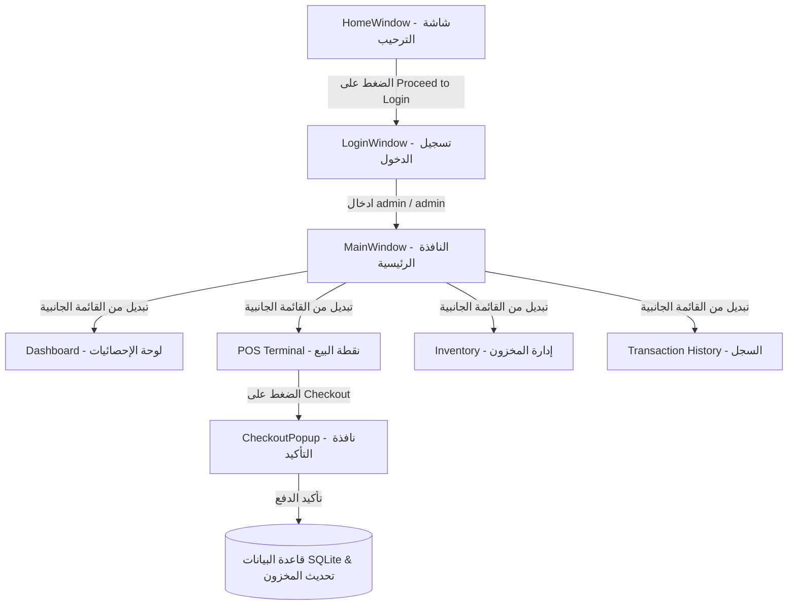

# نظام إدارة المتجر ونقاط البيع (StoreManagement)

هو تطبيق مكتوب بلغة C# وبيئة عمل WPF (Windows Presentation Foundation) باتباع نمط التصميم الشهير **MVVM (Model-View-ViewModel)** لتوفير واجهة مستخدم احترافية ونظام مرن لإدارة المنتجات والمخازن ونقاط البيع والعمليات المالية.

---

## 📂 هيكل المجلدات والملفات (Project Structure)

يتميز المشروع بهيكل تنظيمي ممتاز يفصل منطق البيانات، والتحكم، وواجهة المستخدم:

```text
StoreManagement/
│
├── 📂 Database/
│   └── 📄 DatabaseHelper.cs      # ملف إعداد وإدارة قاعدة البيانات والعمليات SQL
│
├── 📂 Models/
│   ├── 📄 Product.cs             # نموذج يمثل المنتج في المخزن
│   ├── 📄 CartItem.cs            # نموذج يمثل عنصر في سلة المشتريات
│   ├── 📄 Transaction.cs         # نموذج يمثل عملية بيع
│   └── 📄 TransactionItem.cs     # نموذج يمثل تفاصيل صنف داخل عملية البيع
│
├── 📂 ViewModels/
│   ├── 📄 ViewModelBase.cs       # الكلاس الأساسي لتفعيل تحديث الواجهات (INotifyPropertyChanged)
│   ├── 📄 RelayCommand.cs        # الكلاس الأساسي لتمرير الأحداث والأزرار (ICommand)
│   ├── 📄 MainViewModel.cs       # المتحكم الرئيسي للنافذة الأساسية وتبديل الصفحات
│   ├── 📄 HomeViewModel.cs       # المتحكم الخاص بصفحة الترحيب والبداية
│   ├── 📄 LoginViewModel.cs      # المتحكم بنظام تسجيل الدخول والتحقق من الصلاحيات
│   ├── 📄 RegisterViewModel.cs   # المتحكم بنظام إنشاء حساب جديد والتحقق من البيانات
│   ├── 📄 DashboardViewModel.cs  # المتحكم بحساب الإحصائيات والرسم البياني
│   ├── 📄 InventoryViewModel.cs  # المتحكم بإدارة المخزون (إضافة، تعديل، حذف، صور)
│   ├── 📄 PosViewModel.cs        # المتحكم بنظام نقطة البيع والبحث والسلة والدفع
│   └── 📄 CheckoutViewModel.cs   # المتحكم بنافذة تأكيد عملية الدفع والخصم
│
├── 📂 Views/
│   ├── 📄 HomeWindow.xaml (.cs)   # واجهة الترحيب والبداية بالتطبيق
│   ├── 📄 LoginWindow.xaml (.cs)  # واجهة تسجيل الدخول الخاصة بالمسؤول
│   ├── 📄 RegisterWindow.xaml (.cs)# واجهة إنشاء حساب جديد للمسؤولين الجدد
│   ├── 📄 DashboardView.xaml (.cs)# واجهة لوحة الإحصائيات والرسم البياني
│   ├── 📄 InventoryView.xaml (.cs)# واجهة التحكم بالمخزون وإدخال البيانات
│   ├── 📄 PosView.xaml (.cs)      # واجهة نقطة البيع للموظف وسلة المشتريات
│   ├── 📄 HistoryView.xaml (.cs)  # واجهة استعراض تاريخ العمليات وتفاصيل الفواتير
│   ├── 📄 CheckoutPopup.xaml (.cs)# نافذة منبثقة لتأكيد إتمام الدفع وفاتورة العميل
│   └── 📄 Converters.cs           # محولات البيانات (تلوين المخزون المنخفض، نصوص المخزون، إلخ)
│
├── 📂 uploads/                   # مجلد يتم إنشاؤه تلقائياً لحفظ صور المنتجات المرفوعة
├── 📄 store.db                   # قاعدة بيانات SQLite التي تحتوي على جداول المنتجات والمبيعات
├── 📄 App.xaml (.cs)             # نقطة البداية للتطبيق وتحديد واجهة البدء وتكوين المصادر
├── 📄 MainWindow.xaml (.cs)      # النافذة الرئيسية التي تحتوي على القائمة الجانبية ومساحة عرض الصفحات
├── 📄 StoreManagement.csproj     # ملف تكوين المشروع والمكتبات المستخدمة
└── 📄 StoreManagement.sln        # ملف حل الفيجوال ستوديو لتشغيل المشروع كاملاً
```

---

## 🛠️ شرح وظيفة كل ملف بالتفصيل (File Descriptions)

### 1. قاعدة البيانات (`Database/`)

- **`DatabaseHelper.cs`**:
  - عند تشغيل التطبيق لأول مرة، يقوم بإنشاء الملف وجداول المخازن والمبيعات والمستخدمين (`Products`, `Transactions`, `TransactionItems`, `Users`) إذا لم تكن موجودة.
  - يدعم تشفير كلمات المرور باستخدام خوارزمية **SHA-256** والتحقق الآمن من الحسابات وإنشاء مستخدم افتراضي باسم `admin` ورمز `admin`.
  - يحتوي على بيانات تجريبية (Dummy Data) لـ 5 منتجات لتبسيط التجربة الأولى.
  - يحتوي على دوال الاستعلام والتعديل والإضافة والحذف (CRUD) للمنتجات.
  - يحتوي على دالة الدفع `ProcessCheckout` التي تنفذ كعملية متكاملة (SQLite Transaction) تسجل الفاتورة وتفاصيلها وتخصم الكميات المبيعة من المخزن بدقة وفي حال حدوث أي خطأ تتراجع تلقائياً لمنع تلف البيانات.

### 2. النماذج (`Models/`)

- **`Product.cs`**: خصائص المنتج (المعرف، الاسم، SKU، السعر، كمية المخزون، مسار الصورة). يحتوي على خاصية ذكية `IsLowStock` لتعريف ما إذا كانت الكمية تساوي 5 أو أقل، وخاصية `AbsoluteImagePath` للوصول للصورة.
- **`CartItem.cs`**: يربط المنتج بالكمية التي اختارها العميل في السلة مع حساب حاصل الضرب تلقائياً (`TotalPrice`). يرث من `ViewModelBase` ليحدث السعر والكمية فورياً بالواجهة.
- **`Transaction.cs`**: يمثل سجل الفاتورة الرئيسي (رقم الفاتورة، التاريخ، المجموع الفرعي، الضريبة 15%، الإجمالي).
- **`TransactionItem.cs`**: يمثل كل صنف تم بيعه بداخل الفاتورة (الاسم، السعر، الكمية، ورقم الفاتورة التابع لها).

### 3. المتحكمات (`ViewModels/`)

- **`ViewModelBase.cs`**: كلاس حيوي يطبق واجهة `INotifyPropertyChanged` ليسمح لخصائص الـ ViewModels بتحديث عناصر واجهة المستخدم XAML بشكل تلقائي وفوري بمجرد تغير قيمتها.
- **`RelayCommand.cs`**: يسهل ربط أزرار الواجهة XAML بالدوال البرمجية (Commands) في الـ ViewModel مع إمكانية التحقق مما إذا كان الزر متاحاً للضغط (`CanExecute`) أم لا.
- **`MainViewModel.cs`**: يدير التنقل بين الصفحات المختلفة في النافذة الرئيسية. يحتوي على كائنات الصفحات الأربعة (Dashboard, POS, Inventory, History) ويغير الصفحة النشطة (`CurrentViewModel`) عند الضغط على أزرار القائمة الجانبية.
- **`HomeViewModel.cs`**: يتحكم بصفحة الترحيب الأولى ويفتح نافذة تسجيل الدخول عند الضغط على الزر.
- **`LoginViewModel.cs`**: يتحقق من بيانات تسجيل الدخول بالاعتماد على قاعدة البيانات المشفرة ويعرض رسائل الخطأ، كما يوفر أمراً للانتقال لصفحة التسجيل.
- **`RegisterViewModel.cs`**: يتحكم بصفحة تسجيل حساب جديد ويقوم بالتحقق من ملء البيانات وتطابق كلمتي المرور ثم يسجل المستخدم مشفراً بالداتابيز.
- **`DashboardViewModel.cs`**: يقوم بجلب وتحليل البيانات المالية من قاعدة البيانات، مثل حساب إجمالي الأرباح، عدد الفواتير، وإجمالي المنتجات، وتجميع المبيعات يومياً لرسم الأعمدة البيانية التوضيحية.
- **`InventoryViewModel.cs`**: يدير نموذج التحكم بالمنتجات، حيث يوفر دوال الإضافة والتعديل والحذف، ودالة رفع وحفظ الصور في مجلد `uploads` وتوليد أسماء فريدة لها (GUID).
- **`PosViewModel.cs`**: عصب نقطة البيع. يتعامل مع شريط البحث التصفيتي للمنتجات، إضافة المنتجات للسلة، زيادة أو إنقاص الكميات مع التأكد من عدم تجاوز المخزون، وحساب الضريبة (15% VAT)، وفتح نافذة التأكيد وإرسال الفاتورة لقاعدة البيانات.
- **`CheckoutViewModel.cs`**: يتحكم بنافذة الدفع المنبثقة، حيث يعرض المجموع النهائي للعميل للتأكيد أو الإلغاء.

### 4. الواجهات (`Views/`)

- **`HomeWindow.xaml`**: واجهة جذابة تحتوي على شعار التطبيق وبوابة دخول أولية ("Proceed to Login").
- **`LoginWindow.xaml`**: واجهة تسجيل دخول مصممة بأسلوب عصري تحتوي على حقول اسم المستخدم وكلمة المرور ورابط للانتقال لصفحة تسجيل الحساب.
- **`RegisterWindow.xaml`**: واجهة عصرية لإنشاء حساب مستخدم جديد وتأكيد كلمة المرور.
- **`DashboardView.xaml`**: لوحة التحكم الرئيسية وتتكون من:
  1. بطاقات لعرض إجمالي الأرباح، عدد العمليات، والمنتجات.
  2. رسم بياني (Bar Chart) يعرض مبيعات الأيام الأخيرة باستخدام مستطيلات تتغير أطوالها برمجياً بناءً على حجم المبيعات.
  3. بطاقة ترحيبية للمسؤول.
- **`InventoryView.xaml`**: واجهة مقسمة لقسمين:
  1. جدول يعرض كافة المنتجات وحالتها من حيث توفر المخزون (تلوين باللون الأحمر "Low Stock" أو الأخضر "In Stock").
  2. نموذج لإدخال وتعديل بيانات المنتج ورفع صورته عبر متصفح الملفات.
- **`PosView.xaml`**: واجهة البيع السريع وتتكون من:
  1. قائمة المنتجات المتوفرة مع شريط بحث حي للفلترة السريعة وزر إضافة للسلة.
  2. جدول سلة المشتريات لتعديل الكميات أو حذف عناصر.
  3. ملخص الحساب (المجموع، الضريبة 15%، الإجمالي النهائي) وزر إتمام الدفع.
- **`HistoryView.xaml`**: واجهة تتبع العمليات السابقة وتحتوي على:
  1. جدول يعرض كافة الفواتير المسجلة بالتاريخ والمبلغ.
  2. قسم يعرض تفاصيل الفاتورة المحددة متضمناً قائمة الأصناف المشتراة وسعرها وكمياتها.
- **`CheckoutPopup.xaml`**: نافذة تأكيد الدفع لتبسيط العمليات النقدية والتحقق النهائي.
- **`Converters.cs`**: كلاس يحتوي على محولات ربط البيانات (Data Binding Converters):
  - `LowStockBgConverter`: يلون خلفية حالة المنتج بالأحمر إذا كان المخزون منخفضاً وبالأخضر إذا كان متوفراً.
  - `LowStockTextConverter`: يظهر نص "Low Stock" أو "In Stock" بالجدول.
  - `NullToVisibilityConverter`: يخفي تفاصيل الفاتورة في صفحة التاريخ إذا لم يقم المستخدم بتحديد فاتورة من الجدول.

---

## 💻 كيف تعمل الصفحات والتنقل بينها (User Flow & Page Mechanism)



### 🔁 آلية العمل التفصيلية:

1. **البداية والدخول (`HomeWindow` -> `LoginWindow`):**
   - يبدأ التطبيق من شاشة الترحيب `HomeWindow`. بمجرد الضغط على زر الدخول، يتم استدعاء كود في `HomeViewModel` يغلق شاشة الترحيب ويفتح `LoginWindow`.
   - في شاشة تسجيل الدخول، يدخل المسؤول البيانات. عند الضغط على زر الدخول، يقوم `LoginViewModel` بمطابقة البيانات مع القيم الافتراضية. عند النجاح، يتم فتح النافذة الرئيسية `MainWindow` وإغلاق نافذة تسجيل الدخول.

2. **النافذة الرئيسية والتنقل (`MainWindow`):**
   - تعتمد النافذة الرئيسية على تصميم احترافي يحتوي على قائمة جانبية (Sidebar) للملاحة، ومساحة عرض رئيسية مرنة (`ContentControl`).
   - يتم ربط خاصية `Content` في مساحة العرض بخاصية `CurrentViewModel` الموجودة في `MainViewModel`.
   - بفضل ميزة `DataTemplate` المعرفة في موارد نافذة `MainWindow.xaml` (MainWindow Resources)، يتعرف النظام تلقائياً على نوع الـ ViewModel النشط ويقوم برسم الواجهة (`View`) المقابلة له تلقائياً وبسلاسة تامة دون الحاجة لفتح نوافذ جديدة.

3. **لوحة الإحصائيات الفورية (`DashboardView`):**
   - عند عرض هذه الصفحة، يقوم `DashboardViewModel` تلقائياً باستدعاء البيانات من قاعدة البيانات لحساب المؤشرات المالية الحية.
   - يتم عرض الأرقام فورياً. كما يتم تحديث أطوال الأعمدة الخاصة بالرسم البياني لتتناسب مع مبيعات أحدث الفواتير، مما يعطي انطباعاً تفاعلياً ممتازاً.

4. **إجراء عمليات البيع المباشرة (`PosView`):**
   - يعرض هذا القسم جميع المنتجات النشطة بالمخزن. يمكن للموظف البحث بكتابة اسم المنتج أو الرمز التسلسلي (SKU) ليقوم البرنامج بفلترة القائمة فورياً بفضل ربط الحدث بـ `SearchQuery`.
   - عند الضغط على "Add to Cart"، يقوم النظام بفحص الكمية المتوفرة بالمخزن. في حال توفرها، تُضاف السلعة إلى السلة.
   - يمكن تعديل الكمية مباشرة من جدول السلة. ويتم إعادة حساب المجموع والضريبة والإجمالي فورياً وبشكل تلقائي (Reactive Binding).
   - عند الضغط على "Checkout"، تظهر نافذة تأكيد الدفع `CheckoutPopup` لعرض الحساب الإجمالي. وعند التأكيد، تنفذ دالة الدفع بقاعدة البيانات ليتم:
     - خصم الكمية المباعة من مخزون المنتج في جدول `Products`.
     - تسجيل عملية بيع جديدة في جدول `Transactions`.
     - تسجيل المنتجات المباعة في جدول `TransactionItems`.
     - تفريغ السلة وتحديث قائمة المنتجات بالكميات الجديدة المتبقية.

5. **التحكم بالمنتجات والمستودع (`InventoryView`):**
   - واجهة متكاملة تمكن المسؤول من رؤية الكميات الحالية بوضوح.
   - عند الضغط على أي منتج في الجدول، يتم تعبئة حقول النموذج تلقائياً ببيانات المنتج (الاسم، SKU، السعر، المخزون، والصورة).
   - يمكن للمسؤول تعديل البيانات والضغط على "Update Selected" أو حذف المنتج عبر "Delete Selected" أو إضافة منتج جديد تماماً عبر "Add Product".
   - يوفر زر "Upload Image" نافذة لاختيار صورة للمنتج من الجهاز، حيث يقوم النظام بنسخها بمجلد `uploads` التابع للتطبيق وحفظ المسار النسبي لها بقاعدة البيانات لضمان ظهور الصورة بأي جهاز آخر يُشغل النظام.

6. **مراجعة وتتبع الفواتير (`HistoryView`):**
   - يعرض هذا القسم جميع الفواتير السابقة مرتبة من الأحدث للأقدم.
   - عند قيام المسؤول بالضغط وتحديد أي فاتورة من جدول الفواتير، يقوم النظام فورياً بجلب كافة السلع المبيعة بداخلها من جدول تفاصيل العمليات ويعرضها في الجدول الصغير المقابل مع عرض المجموع الفرعي والضريبة والقيمة الإجمالية لتلك الفاتورة تحديداً بوضوح تام.
