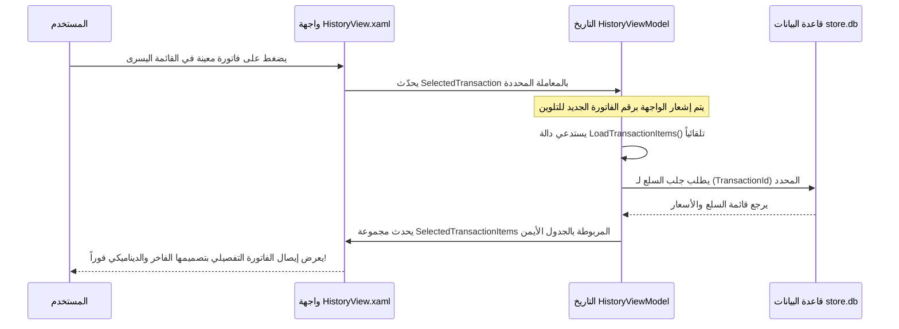

# توثيق نظام سجل المعاملات (Transaction History) - StoreManager

يحتوي هذا الملف على شرح تفصيلي وشامل لبنية وعمل صفحات **سجل المعاملات (Transaction History)** في مشروع **StoreManager** (WPF / SQLite). ينقسم الشرح إلى ثلاثة مستويات برمجية رئيسية وفقاً لنمط التصميم **MVVM** (Model-View-ViewModel):
1. **طبقة قاعدة البيانات (Database Layer):** شرح الجداول والعمليات البرمجية في `DatabaseHelper.cs`.
2. **طبقة العرض والتحكم (ViewModel Layer):** شرح منطق ربط البيانات والأحداث في `HistoryViewModel.cs`.
3. **طبقة واجهة المستخدم (View Layer):** شرح تصميم وتنسيقات واجهة الـ XAML وتفاعل المكونات البصرية في `HistoryView.xaml`.

---

## 1. طبقة قاعدة البيانات (Database Layer)
الملف المسؤول: [`DatabaseHelper.cs`](file:///d:/LEVEL%203/s2/HCI/project%20Gui/StoreManagement/Database/DatabaseHelper.cs)

تدير هذه الطبقة جميع عمليات الإدخال والاسترجاع من قاعدة بيانات **SQLite** المحلية (`store.db`).

### أ. جداول المعاملات في قاعدة البيانات
عند تشغيل التطبيق، تقوم دالة `InitializeDatabase()` بإنشاء ثلاثة جداول رئيسية مرتبطة بنظام المبيعات:

1. **جدول العمليات الكلية `Transactions`:**
   يخزن البيانات المالية الأساسية لكل عملية بيع مكتملة.
   ```sql
   CREATE TABLE IF NOT EXISTS Transactions (
       Id INTEGER PRIMARY KEY AUTOINCREMENT, -- رقم الفاتورة (تلقائي)
       Date TEXT NOT NULL,                  -- تاريخ ووقت الفاتورة
       Subtotal REAL NOT NULL,              -- المجموع الفرعي قبل الضرائب
       Tax REAL NOT NULL,                   -- قيمة الضريبة المضافة (15%)
       Total REAL NOT NULL                  -- المبلغ الإجمالي المدفوع
   )
   ```

2. **جدول تفاصيل المنتجات المشتراة `TransactionItems`:**
   يخزن المنتجات التي تم شراؤها داخل كل فاتورة (علاقة رأس بأطراف One-to-Many مع جدول العمليات).
   ```sql
   CREATE TABLE IF NOT EXISTS TransactionItems (
       Id INTEGER PRIMARY KEY AUTOINCREMENT, -- معرف فرعي تلقائي
       TransactionId INTEGER NOT NULL,       -- رقم الفاتورة المرتبط بها (FK)
       ProductName TEXT NOT NULL,            -- اسم المنتج وقت الشراء
       Price REAL NOT NULL,                  -- سعر المنتج وقت الشراء
       Quantity INTEGER NOT NULL             -- الكمية المباعة
   )
   ```

### ب. الدوال البرمجية وقاعدة البيانات

#### 1. دالة معالجة عملية البيع والدفع `ProcessCheckout`
يتم استدعاء هذه الدالة عند إتمام عملية الشراء في صفحة المبيعات (POS Terminal). تستخدم الدالة مفهوم **SQLiteTransaction** لضمان سلامة البيانات (بحيث إما أن تنجح العملية بالكامل أو تُلغى بالكامل في حال حدوث أي خطأ لمنع حدوث خلل في كميات المخزن).

```csharp
public static void ProcessCheckout(Transaction transaction, List<CartItem> cartItems)
{
    using (SQLiteConnection connection = new SQLiteConnection(connectionString))
    {
        connection.Open();
        using (SQLiteTransaction sqlTransaction = connection.BeginTransaction())
        {
            try
            {
                // 1. إدخال سجل الفاتورة الرئيسي واسترجاع المعرف التلقائي المتولد (Last Insert Row ID)
                string insertTransQuery = "INSERT INTO Transactions (Date, Subtotal, Tax, Total) VALUES (@Date, @Subtotal, @Tax, @Total); SELECT last_insert_rowid();";
                using (SQLiteCommand command = new SQLiteCommand(insertTransQuery, connection))
                {
                    command.Parameters.AddWithValue("@Date", transaction.Date.ToString("yyyy-MM-dd HH:mm:ss"));
                    command.Parameters.AddWithValue("@Subtotal", transaction.Subtotal);
                    command.Parameters.AddWithValue("@Tax", transaction.Tax);
                    command.Parameters.AddWithValue("@Total", transaction.Total);
                    long transId = (long)command.ExecuteScalar();
                    transaction.Id = (int)transId; // حفظ الرقم التعريفي المتولد
                }

                // 2. إدخال عناصر الفاتورة وتحديث كمية المخزن لكل منتج
                foreach (CartItem item in cartItems)
                {
                    // أ. إدخال تفاصيل المنتج المباع
                    string insertItemQuery = "INSERT INTO TransactionItems (TransactionId, ProductName, Price, Quantity) VALUES (@TransactionId, @ProductName, @Price, @Quantity)";
                    using (SQLiteCommand command = new SQLiteCommand(insertItemQuery, connection))
                    {
                        command.Parameters.AddWithValue("@TransactionId", transaction.Id);
                        command.Parameters.AddWithValue("@ProductName", item.Product.Name);
                        command.Parameters.AddWithValue("@Price", item.Product.Price);
                        command.Parameters.AddWithValue("@Quantity", item.Quantity);
                        command.ExecuteNonQuery();
                    }

                    // ب. تحديث كمية المنتج في المخزن (طرح الكمية المباعة)
                    string updateStockQuery = "UPDATE Products SET StockQuantity = StockQuantity - @Quantity WHERE Id = @ProductId";
                    using (SQLiteCommand command = new SQLiteCommand(updateStockQuery, connection))
                    {
                        command.Parameters.AddWithValue("@Quantity", item.Quantity);
                        command.Parameters.AddWithValue("@ProductId", item.Product.Id);
                        command.ExecuteNonQuery();
                    }
                }

                // 3. اعتماد كافة التغييرات وحفظها بشكل نهائي
                sqlTransaction.Commit();
            }
            catch (Exception ex)
            {
                // إلغاء كل التغييرات السابقة في حال حدوث أي فشل للحفاظ على سلامة وتناسق المخزون
                sqlTransaction.Rollback();
                throw new Exception("Checkout failed: " + ex.Message);
            }
        }
    }
}
```

#### 2. دالة استرجاع قائمة الفواتير `GetTransactions`
تسترجع كافة المعاملات المسجلة من الأحدث إلى الأقدم لتعرض مباشرة في القائمة الرئيسية اليسرى.
```csharp
public static List<Transaction> GetTransactions()
{
    List<Transaction> transactions = new List<Transaction>();
    using (SQLiteConnection connection = new SQLiteConnection(connectionString))
    {
        connection.Open();
        string query = "SELECT * FROM Transactions ORDER BY Id DESC"; -- الترتيب من الأحدث للأقدم
        using (SQLiteCommand command = new SQLiteCommand(query, connection))
        {
            using (SQLiteDataReader reader = command.ExecuteReader())
            {
                while (reader.Read())
                {
                    Transaction t = new Transaction();
                    t.Id = Convert.ToInt32(reader["Id"]);
                    t.Date = Convert.ToDateTime(reader["Date"]);
                    t.Subtotal = Convert.ToDecimal(reader["Subtotal"]);
                    t.Tax = Convert.ToDecimal(reader["Tax"]);
                    t.Total = Convert.ToDecimal(reader["Total"]);
                    transactions.Add(t);
                }
            }
        }
    }
    return transactions;
}
```

#### 3. دالة استرجاع عناصر فاتورة معينة `GetTransactionItems`
تسترجع جميع المنتجات المشتراة المرتبطة برقم فاتورة محددة لعرضها في جدول العناصر التفصيلي الأيمن.
```csharp
public static List<TransactionItem> GetTransactionItems(int transactionId)
{
    List<TransactionItem> items = new List<TransactionItem>();
    using (SQLiteConnection connection = new SQLiteConnection(connectionString))
    {
        connection.Open();
        string query = "SELECT * FROM TransactionItems WHERE TransactionId = @TransactionId";
        using (SQLiteCommand command = new SQLiteCommand(query, connection))
        {
            command.Parameters.AddWithValue("@TransactionId", transactionId);
            using (SQLiteDataReader reader = command.ExecuteReader())
            {
                while (reader.Read())
                {
                    TransactionItem item = new TransactionItem();
                    item.Id = Convert.ToInt32(reader["Id"]);
                    item.TransactionId = Convert.ToInt32(reader["TransactionId"]);
                    item.ProductName = reader["ProductName"].ToString();
                    item.Price = Convert.ToDecimal(reader["Price"]);
                    item.Quantity = Convert.ToInt32(reader["Quantity"]);
                    items.Add(item);
                }
            }
        }
    }
    return items;
}
```

---

## 2. طبقة العرض والتحكم (ViewModel Layer)
الملف المسؤول: [`HistoryViewModel.cs`](file:///d:/LEVEL%203/s2/HCI/project%20Gui/StoreManagement/ViewModels/HistoryViewModel.cs)

يعمل الـ ViewModel كوسيط ديناميكي يربط واجهة الـ XAML بالبيانات القادمة من قاعدة البيانات عبر توظيف خصائص الإشعار بالتغيير `INotifyPropertyChanged`.

### المكونات الرئيسية للـ ViewModel:

1. **المجموعات القابلة للملاحظة (Observable Collections):**
   * `Transactions`: تخزن قائمة الفواتير الإجمالية المكتشفة. استخدام `ObservableCollection` يسمح لجدول الـ XAML بتحديث واجهته تلقائياً فور تعديل محتويات هذه القائمة دون الحاجة لإعادة تحميل كاملة.
   * `SelectedTransactionItems`: تخزن قائمة العناصر المشتراة المرتبطة بالفاتورة المحددة حالياً.

2. **متابعة الفاتورة المحددة والتحديث التلقائي للتفاصيل:**
   تحتوي على الخاصية `SelectedTransaction` التي عند تغيير قيمتها (بسبب قيام المستخدم بالنقر على فاتورة معينة في القائمة اليسرى)، يتم استدعاء دالة جلب العناصر وتحديث الواجهة مباشرة:
   ```csharp
   private Transaction _selectedTransaction;
   public Transaction SelectedTransaction
   {
       get { return _selectedTransaction; }
       set 
       { 
           _selectedTransaction = value; 
           OnPropertyChanged(); -- إشعار واجهة المستخدم بوجود اختيار جديد لتلوين الفاتورة المحددة وعرض بياناتها
           LoadTransactionItems(); -- استدعاء دالة جلب تفاصيل السلع المشتراة تلقائياً من قاعدة البيانات
       }
   }
   ```

3. **دوال جلب وتعبئة البيانات:**
   * **`LoadTransactions`:** تقوم بمسح القائمة الحالية وجلب الفواتير المسجلة في جدول `Transactions` بقاعدة البيانات وتعبئتها.
     ```csharp
     public void LoadTransactions()
     {
         Transactions.Clear();
         var trans = DatabaseHelper.GetTransactions();
         foreach (var t in trans)
         {
             Transactions.Add(t);
         }
     }
     ```
   * **`LoadTransactionItems`:** تجلب تفاصيل المنتجات وتفاصيل أسعارها للفاتورة الحالية المحددة عبر رقم المعرّف الخاص بها.
     ```csharp
     private void LoadTransactionItems()
     {
         SelectedTransactionItems.Clear();
         if (SelectedTransaction != null)
         {
             var items = DatabaseHelper.GetTransactionItems(SelectedTransaction.Id);
             foreach (var item in items)
             {
                 SelectedTransactionItems.Add(item);
             }
         }
     }
     ```

---

## 3. طبقة واجهة المستخدم (View Layer)
الملف المسؤول: [`HistoryView.xaml`](file:///d:/LEVEL%203/s2/HCI/project%20Gui/StoreManagement/Views/HistoryView.xaml)

تم تصميم هذه الواجهة لتعطي تجربة مستخدم تفاعلية واحترافية للغاية، وتتكون الواجهة من قسمين رئيسيين ومقسمين بواسطة `Grid`:

### أ. الجدول الأيسر: قائمة سجل العمليات المبسطة
يعرض القائمة التاريخية لجميع المعاملات التي تمت.
* يرتبط بجدول المعاملات الأساسية: `ItemsSource="{Binding Transactions}"`.
* يرتبط بالعنصر المختار حالياً بالـ ViewModel: `SelectedItem="{Binding SelectedTransaction}"`.
* يستخدم النمط المخصص المطور `Style="{StaticResource HistoryDataGridStyle}"` والذي يضمن:
  * إخفاء الخطوط الفاصلة التقليدية لإعطاء مظهر عصري.
  * تصميم تمييز الصف المختار بأسلوب ناعم وبخلفية ذات لون أزرق خفيف جداً `#EBF3FF` مع تغيير النص للون الأزرق الأنيق `#0D6EFD` بدلاً من الخلفية الزرقاء القاتمة والبدائية لنظام التشغيل الافتراضي.
  * تأثير التمرير (Hover Effect) بتلوين الصف باللون الرمادي الخفيف المريح للعين `#F5F6FA`.

### ب. اللوحة اليمنى: فاتورة الإيصال التفصيلي الفاخرة (Dark Receipt Theme)
تم تصميمها بشكل يشبه الإيصالات الرقمية الحديثة للشركات الكبرى، وتتضمن:

1. **مبدل الواجهة الذكي (Conditional Views):**
   * **إذا كان `SelectedTransaction` قيمته فارغة (Null):**
     يتم تفعيل شرط `DataTrigger` المخصص في XAML لإظهار واجهة جذابة خالية من البيانات (Empty State) تحتوي على **أيقونة الفاتورة 📄** ونص يوجه المستخدم بالنقر على أي معاملة على اليسار ليتم عرض تفاصيلها بدلاً من عرض لوحة سوداء فارغة ومبهمة.
   * **إذا كان `SelectedTransaction` يحتوي على فاتورة:**
     تختفي شاشة التوجيه الفراغي وتظهر الفاتورة بتصميمها المذهل.

2. **تفاصيل رأس الفاتورة (Invoice Header & Status Badge):**
   * يعرض معلومات الفاتورة واسمها التعريفي باللون الأبيض الساطع.
   * شارة خضراء مستديرة وجذابة مكتوب عليها **PAID** تدل بصرياً على حالة الفاتورة المكتملة بالنجاح.
   * تفاصيل السطر السفلي مقسمة بواسطة جدول (`Grid`) يعرض التاريخ والوقت المفصل واسم الموظف أو النظام بشكل مرتب.

3. **جدول محتويات الفاتورة الداكن (`DetailsDataGridStyle`):**
   * جدول داكن بالكامل مصمم خصيصاً للتفاصيل، يزيل كل الخلفيات والحدود والخطوط الفاصلة الافتراضية لبرنامج WPF.
   * يعرض أسماء المنتجات وكمياتها وسعرها مع خطوط تقسيم أفقية مدمجة وخفيفة جداً بلون `#2D323E`.
   * صفوف تفاعلية تضيء بخلفية مريحة بلون `#252A34` عند تمرير مؤشر الماوس فوقها.

4. **لوحة الملخص المالي السفلي (Summary Box):**
   * لوحة داكنة منفصلة دائرية الحواف بلون `#252A34` تعطي تأثيراً رائعاً.
   * توزيع تفاصيل المجموع الفرعي للسلع والضريبة بنسب مئوية دقيقة.
   * استخدام **فاصل منقط رفيع (Dotted Border)** مستوحى من فواتير الشراء الحقيقية.
   * إبراز **المجموع الإجمالي المدفوع (Total Paid)** بخط عريض وحجم كبير جداً وبلون أزرق ساطع (`#0D6EFD`) ليتضح للمستخدم القيمة النهائية للفاتورة بلمح البصر وبشكل فائق الاحترافية.

---

### ملخص تدفق البيانات وتفاعل المستخدم:


تم تطوير وتكامل هذا الهيكل ليقدم واجهة مستخدم فائقة الجودة الجمالية وسرعة أداء عالية بفضل استخدام محول البيانات المخصص وتصميم الـ WPF الاحترافي الذي يخلو من أي تعقيدات زائدة.
